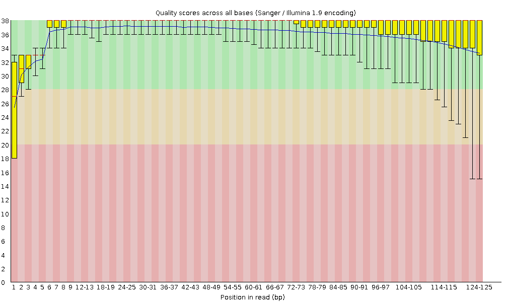
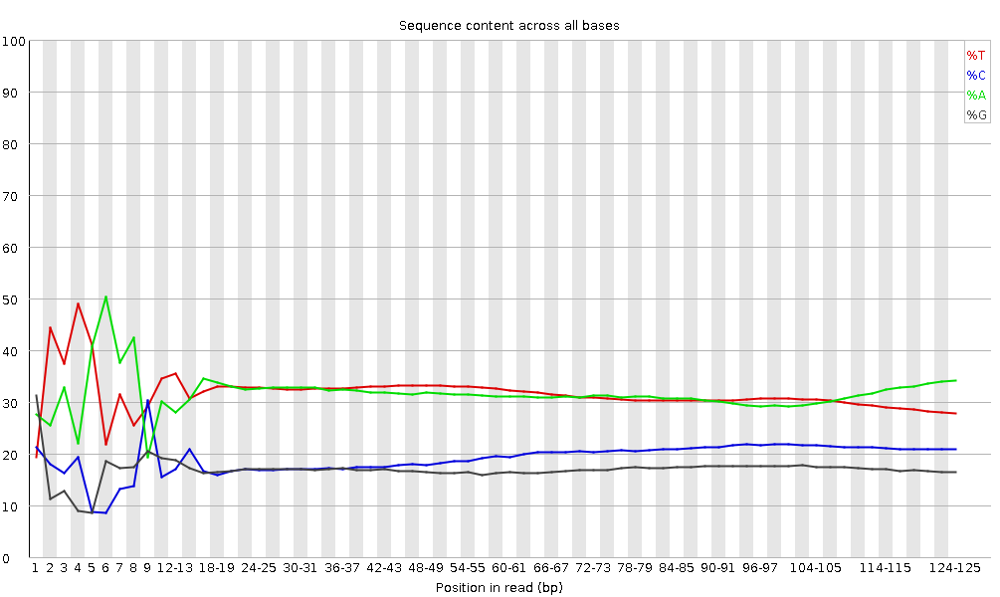
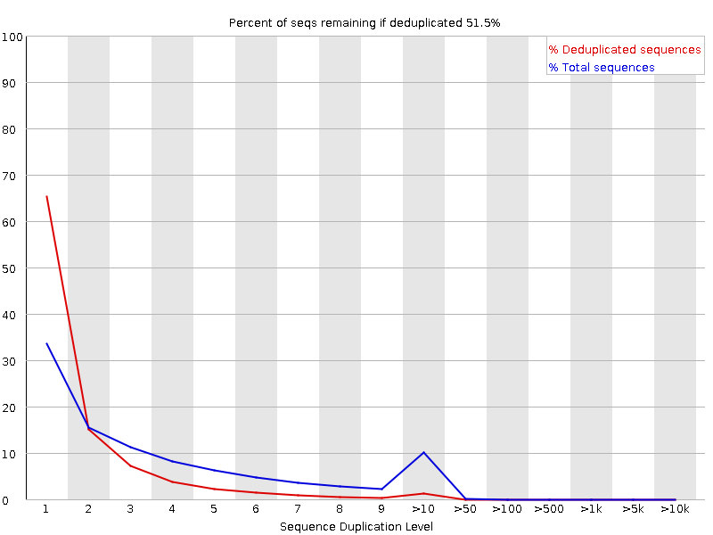
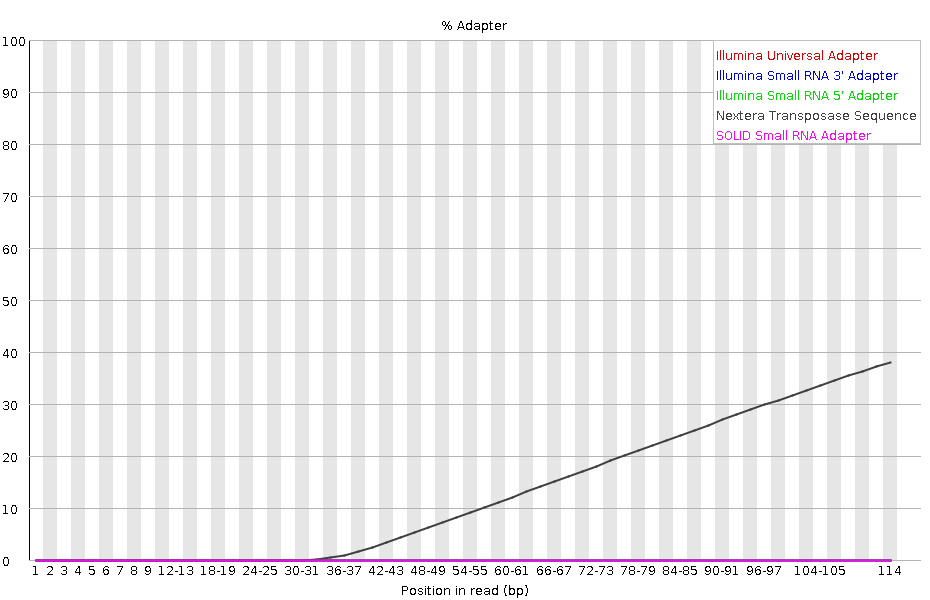
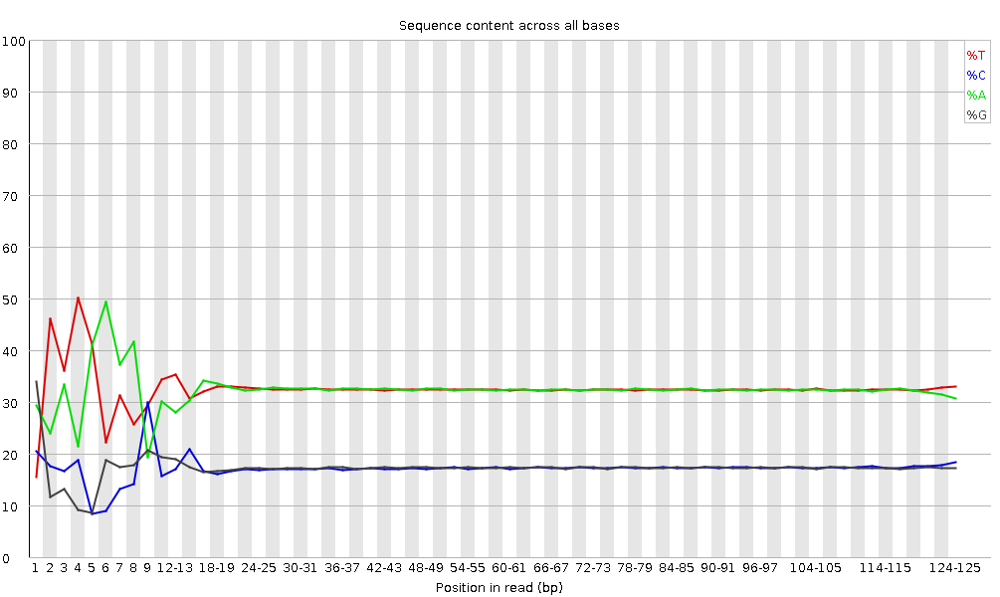
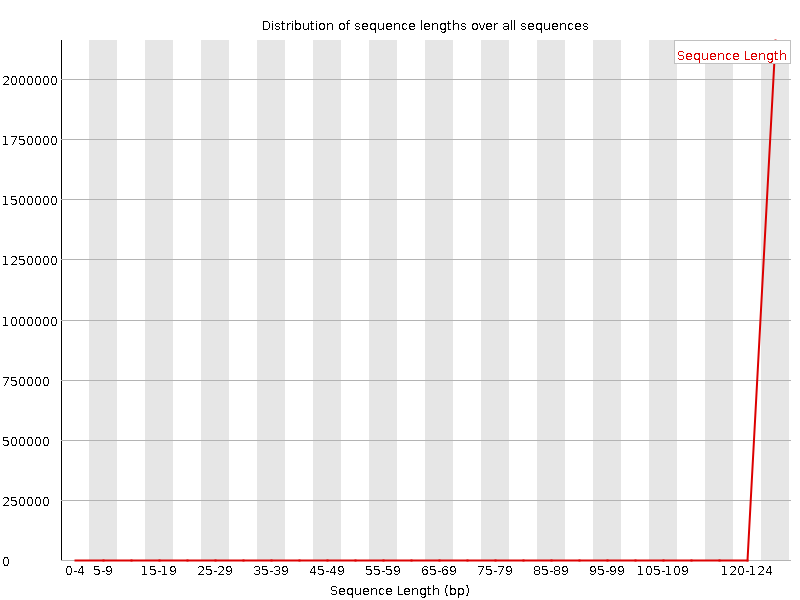
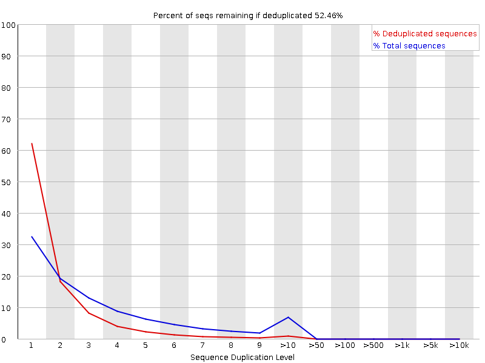

# Marine Biology 740 Short Project 2

Group: Oscar Ramfelt and Herman Li

Link to Github repository [here](https://github.com/kolaban/mbio740-short-project2)

## Download

Shotgun sequencing data was downloaded from SRX6892810 using the following command:

```Bash
fastq-dump --split-files SRX6892810
```

Which downloaded the forward (SRR10167988_1.fastq) and reverse (SRR10167988_2.fastq) reads. We also downloaded the reference genome for *Staphylococcus aureus* using the ftp link to its assembly found [here](https://ftp.ncbi.nlm.nih.gov/genomes/all/GCA/000/013/425/GCA_000013425.1_ASM1342v1/GCA_000013425.1_ASM1342v1_genomic.fna.gz) (GCA_000013425.1_ASM1342v1_genomic.fna.gz).

### Raw Coverage

We found the coverage of the reference genome is the shotgun sequencing data by using bowtie2 (version = 2.3.5.1). The two following command was used when running bowtie2:

```Bash
bowtie2-build GCA_000013425.1_ASM1342v1_genomic.fna.gz staphylococcus
```

```Bash
bowtie2 --threads 6 -x reference/staphylococcus \
        --no-unal \
        -1 SRR10167988_1.fastq \
        -2 SRR10167988_2.fastq \
        -S staphylococcus_bowtie.sam
```

Following this we then used samtools to find the average coverage depth.

```Bash
samtools view -F 4 -bS staphylococcus_bowtie.sam > staphylococcus_bowtie-RAW.bam
samtools sort staphylococcus_bowtie-RAW.bam -o staphylococcus_bowtie.bam
samtools index staphylococcus_bowtie.bam
```

Calculation of coverage was done using samtools and based off the helpful advice of [this](https://sarahpenir.github.io/bioinformatics/awk/calculating-mapping-stats-from-a-bam-file-using-samtools-and-awk/) website.

```Bash
samtools depth -a staphylococcus_bowtie.bam | awk '{c++; if($3>0) total+=1}END{print (total/c)*100}'
```

This gave us a coverage of **93.4082%** across the genome.

#### Bowtie 2 Software

Bowtie 2 is a read alignment software that allows you to take a reference genome and find if/where reads from your fastq file map to it. You can change the mapping parameters to be more or less strict depending on what the purpose of your mapping is. A potential issue with using the software is that you might choose parameters where you are too strict with the reads and loose coverage across your genome since you might be attempting to sequence a close relative that has a slightly different genome in some location along the genome. On the other hand you might choose parameters that are too lenient which could incorporate reads that are not actually a part of the genome and don't represent "true" variation in the genome.

#### Samtools Software

Samtools is a software that contains plenty of useful tools to help you process sam files and extract various interesting bits of information from them. There aren't any clear biases that can come from this step since you are mostly just extracting information from the sam files that bowtie 2 generated.

## Fastqc

### Output

The raw reads were then quality checked using fastqc through the following command:

```Bash
fastqc SRR10167988_1.fastq
fastqc SRR10167988_2.fastq
```

Producing two html files with the reads associated statistics, the html files can be found in the read_quality directory. Based on these two html reports it seems that overall the quality of the data is good with some minor issues. The graphs were roughly i dentical between the forward and reverse reads so only the graphs for forward reads.

#### Per Base Sequence Quality



#### Per Base Sequence Content



#### Sequence Duplication Levels



#### Adapter Content



### Cleaning Strategy

The overall cleaning strategy will be to remove the first few bases since they are both lower quality compared to the others and show a strange pattern in the per base sequence content graph. It also seems that there is a signficant amount of adapter content on the tail end of the reads showing that any cleaning strategy should include adapter trimming to remove those issues.

#### Fastqc Software

Fastqc is a program that helps visualize and provide tips on how to clean up your raw reads. It mainly acts as a visualization for various important quailty metrics across all the reads that you have access to. An interesting bias that can come from using it is attempting to get green check marks for all the metrics that Fastqc has. This could result in you removing more reads than you should have. Something that I saw mentioned a few times is that Fastqc doesn't know what analysis you are going for and so you have to put what you see from it in persepective together with knowledge about any biases that are too be expect with e.g the library preperation.

## Trimmomatic

To clean up the sequences we used Trimmomatic (version = 0.39), we decided to remove the first few bases and the last two to reduce the issues that Fastqc showed us as well as add an adapter trimming step to remove the adapter content that Fastqc showed us was an issue. Based on the Fastqc graph it seems that the adapters are Nextera adapters so we used the pair end adapters that come default with trimmomatic i.e. NexteraPE-PE.fa.

```Bash
trimmomatic PE SRR10167988_1.fastq SRR10167988_2.fastq \
            forward_good forward_fail reverse_good reverse_fail \
            ILLUMINACLIP:/opt/conda/share/trimmomatic-0.39-1/adapters/NexteraPE-PE.fa:2:30:10 \
            LEADING:3 TRAILING:2
```

### Post QC Results

Despite the previous efforts to do qc with trimmomatic it seems that the per base sequence content remains an issue. However, after some reseach online about the nextera library prep method it seems that this is likely due to the library prep itself and one can choose whether or not to remove it. More information found [here](http://seqanswers.com/forums/showthread.php?t=45024).

There were some warnings in the data that did not show up previously but they did not seem too severe and were likely due to the fact that we had trimmed off sequences. The three graphs where we had warnings/fails are shown below.

#### Per Base Sequence Content



#### Sequence Length Distribution



#### Sequence Duplication Levels



In addition to running Fastqc we also ran bowtie2 again to check for any change in coverage across the *Staphylococcus aureus* genome. Our command is identical to what we ran earlier except that we are now using the cleaned up fastq files.

```Bash
bowtie2 --threads 6 -x ../reference/staphylococcus \
        --no-unal \
        -1 ../qc_reads/forward_good \
        -2 ../qc_reads/reverse_good \
        -S staphylococcus_bowtie_post.sam
```

We then used the same method outlined previously to calculate average coverage.

```Bash
samtools view -F 4 -bS staphylococcus_bowtie_post.sam > staphylococcus_bowtie_post-RAW.bam
samtools sort staphylococcus_bowtie_post-RAW.bam -o staphylococcus_bowtie_post.bam
samtools index staphylococcus_bowtie_post.bam
```

Coverage calculations also followed the same method.

```Bash
samtools depth -a staphylococcus_bowtie_post.bam | awk '{c++; if($3>0) total+=1}END{print (total/c)*100}'
```

Giving use a coverage of **93.3981%** which is almost no change from our estimation prior to cleaning, which probably means that none of the reads that we removed were core to the genome that we want to assemble.

#### Trimmomatic Software

Trimmomatic is a trimming software that helps clean up and remove "bad" reads from your dataset. It does this by removing bases from either end of your reads based on various parameters that you can set. It also includes some helpful predefined adapters that it can remove from your reads if it finds them. Largely the potential biases with this is that you forget to trim your reads or trim them too much. Trimming too much can lead to short reads that might not work as well (or work too well) during the mapping step. However, if you do not trim at all you might leave e.g. adapter sequences or low quality bases in your reads that could also skew your mapping/assembly results.

## Spades

Prior to assembly there was a name change for the trimmed reads using the following command. This was mainly done so that spades would accept the reads.

```Bash
mv forward_good forward_good.fastq
mv reverse_good reverse_good.fastq
```

For the assembly we used Spades (version = 3.14.0) with the following command being run. The --careful flag was used to optimze the assembly according and reduce the number of mismatches and indels to the [spades website](http://cab.spbu.ru/files/release3.11.1/manual.html#sec3.2).

```Bash
spades.py -1 forward_good.fastq -2 reverse_good.fastq -o ../spades_assembly -t 6 --careful
```

However, following completion of assembly Spades suggested that due to the high uniform coverage depth we run it again and add the isolate flag. Based on this suggestion we reran spades again with that flag and removed the --careful flag since you cannot use it together with the isolate flag.

```Bash
spades.py -1 forward_good.fastq -2 reverse_good.fastq -o ../spades_assembly_isolate -t 6 --isolate
```

#### Spades Software

The spades software attempts to assemble a genome based on individual paired end reads. It uses the paired end reads to create contigs afterwhich it uses these contigs to create scaffolds. Potential issues with assembly are usually due to inadequate screening of the reads which is why quality control is important before handing over the reads to an assembler. Additionally, for due to the nature of *de Brujin* graphs you should also watch out for areas of unusually high coverage since this might lead to problems down the road. Subsampling seems to be the best route to avoid this issue.

## QUAST

The resulting assembly statistics were then checked using QUAST (version =) this was done with the scaffolds.fasta output from Spades. This decision was made largely based on the fact that the [Spades website](http://cab.spbu.ru/files/release3.14.0/manual.html#sec3.5) suggests using this instead of the contigs output as the resulting sequences.

```Bash
quast.py ./spades_assembly_isolate/scaffolds.fasta -o spade_stats
```

The stats for our assembly were as follows:

* **Length:** 2841771 ≈ 2.84 Mbp
* **Number of contigs:** 46
* **N50:** 123068 bp
* **Largest Contig:** 245046 bp

Comparing this to the "true" genome for *Staphylococcus aureus* we see that this is fairly close to what we would expect. Interestingly our assembly is actually a bit larger than what we would expect compared to the true genome.

* **Length:** 2821361 ≈ 2.82 Mbp
* **Number of contigs:** 1

#### QUAST Software

QUAST is a software that helps give you an overview of your assembly. It takes in your assembly and outputs various statistics about it. While there is not any biases directly related to QUAST since it seems to only take the assembly and output statistics for it there may be issues in trying to optimize some of the parameters that it has. For example if you try to use a different assembler that produces longer contigs/scaffolds but actually is joining regions that shouldn't be joined. Producing a worse assembly despite an greater N50.

## Prokka

For annotation of genes we used Prokka (version = 1.14.6)

```Bash
prokka spades_assembly_isolate/scaffolds.fasta --cpus 6 --outdir annotation/
```

#### Prokka Software

The Prokka software attempts to annotate your scaffolds and attach gene references to the various sequences found inside the assembly. This is mainly to help understand what kinds of genes are found in the assembly and to understand what the assembled genome is able to translate. Issues come with the database that is used for annotation since you may not have as many available references. This could bias the annotation for those genes that are more widely used and more widely found in the literature.

## **Analysis**
---

## Pre-Analysis Processing

Although Prokka did annotate the genes, it could not be matched with a GO molecular function due to the different labeling. Instead we used a pre-generated file with the appropriate annotations to generate the GO molecular function list. With this output, using some Python code, the code counted the number of appearances of each annotation. With this table, the code then retrieved the GO molecular function list of each annotation from UniProt. From this list, another count was made of the GO functions to get the actual count of each GO function. The count was then outputted as a TSV file with the GO function in the first column and the count in the second.

For the bacteria to compare this bacteria with, *Sulfurovum lithotrophicum*, the GO molecular function list was already given but need to be counted and a similar process was done as before to get the counts of each Go function. Again, it was outputted as a TSV file with the GO function in the first column and the count in the second.

Files used to generate tables are in the analysis folder of this repository.

## Comparisons

To simplify the comparisons, only the top 50 GO molecular functions will be looked at and compared. The first 15 functions have very similar counts in the same order more or less. Looking at their biological functionality. They mostly deal with key cellular organelles and functions like the membranes, cytoplasm, ribosomes and protein generation, and ion bindings. In general, all values which differ has the Staph cell containing more genes encoding for each functionality. This makes sense because it has a bigger genome size.

When comparing them based on the differences between the numbers, Staph in general had a higher count of genes with functions related to DNA including replication, transcription, and repair. Of note, both bacteria have antibiotic response functions with Staph having 20 and the other with 18. Two functions which have a count of two which Staph has but the sulfur bacterium does not are 5'-3' exoribonuclease activity and double-strand break repair. Given Staph has a bigger genome, it makes sense why it contains more functions related to processing and protecting it. When looking at the environment of each bacteria with Staph from the throat/mouth of a human and the sulfur bacteria from hyrdothermal sediments (BacDive), it might have an affect on this distribution as well. Given that the human body generally does attack pathogens, of which Staph is, the increase in DNA functions might help to defend itself from the damages caused by human defense mechanism. On the other hand, being at the bottom of the sea might reduce that need even though the environment near hydrothermal vents can be considered extreme.

Comparing the similarities, most of the similar items relates to basic cell functionality like protein synthesis and ribosomes. Given that all cells need such processes and organelles because life processes are based on these basics, it makes sense why they have the exact same numbers.

---

## Citations

Sulfurovum lithotrophicum https://bacdive.dsmz.de/index.php?search=6117
Staphylococcus aureus https://bacdive.dsmz.de/index.php?search=14487
